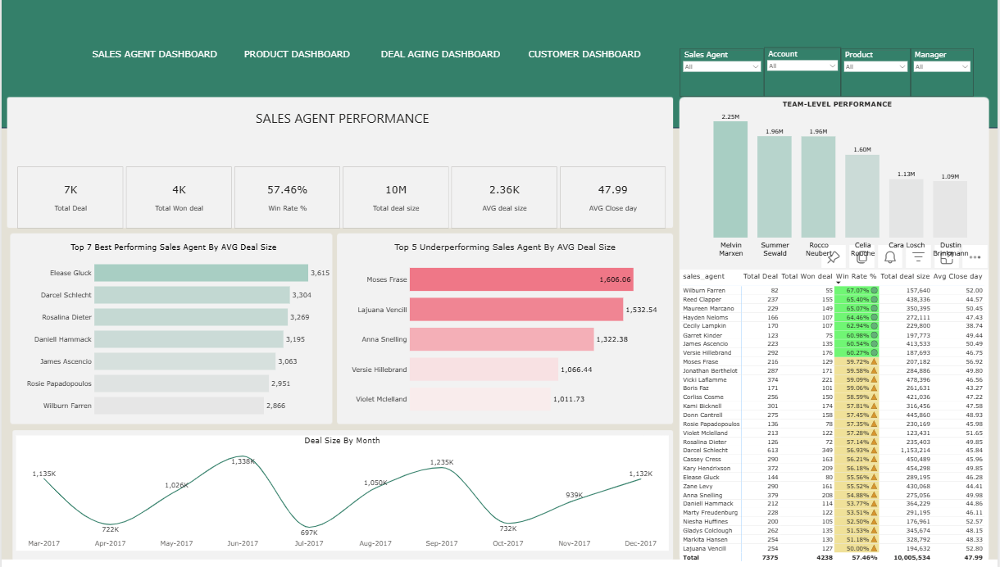

# CRM Sales Opportunity Analysis

## 🎯 Project Objective
This project aims to uncover insights from CRM sales data to answer the following key business questions:

1. **Sales Team Performance** – How does each team’s performance compare against others?  
2. **Sales Agent Gaps** – Are there agents consistently lagging in win rate, deal size, or closed revenue?  
3. **Quarter-over-Quarter Trends** – What patterns or shifts can be observed in performance over time?  
4. **Product Win Rate Leaders** – Which products achieve the highest win rates?  
5. **High-Value Products** – Which products generate the largest deal values?  
6. **Pipeline Bottlenecks** – Identify deals stuck too long in the *Engaging* or *Prospecting* stages.  
7. **Opportunity Aging** – Track average deal age per agent and per team to spot delays.  
8. **Top Customer Accounts** – Focus on the highest-revenue or highest-volume customers, analyzing:
   - Number of deals over time  
   - Products purchased  

---

## 📂 Data Source
- Dataset obtained from **Maven Analytics**
- Uploaded CSV files into a **Lakehouse** environment.
- Created a **Dataflow** for cleaning, transforming, and structuring the data for analysis.

---

## 🛠 Data Preparation Steps

### 1. Date Table Creation
To analyze time-based trends, a **custom Date Table** was created in Power Query.

**Step 1: Identify Date Range**
 ```powerquery
- Earliest engagement date:  

  List.Min(List.RemoveNulls(Source[engage_date]))
- Latest close date:
  
  List.Min(List.RemoveNulls(Source[engage_date]))
**Step 2: Generate Date List

List.Dates(
    StartDate, 
    Duration.Days(EndDate - StartDate) + 1, 
    #duration(1, 0, 0, 0)
)

Step 3: Convert List to Table
  
Table.FromList(DateList, Splitter.SplitByNothing(), {"Date"})

Step 4: Add Date Attributes
 
**YEAR
 Table.AddColumn(#"Changed column type with locale", "Year", each Date.Year([Date]), type nullable number)

**MONTH NAME:
Table.AddColumn(#"Inserted year", "Month name", each Date.MonthName([Date]), type nullable text)

**QUARTER-YEAR:
Table.AddColumn(#"Removed columns 2", "Quarter-Year", each Text.From(Date.Year([Date])) & "-" & "Qrt" & " " & Text.From(Date.QuarterOfYear([Date])), type text)

**DAY NAME:
Table.AddColumn(#"Inserted week of month", "Day name", each Date.DayOfWeekName([Date]), type nullable text)
 ```

# Data Modelling
Schema Design: Implemented a Star Schema to ensure optimized querying and clear separation of dimensions and facts.

## Relationships:
The fact table is the Sales Pipeline.
The dimension tables are Date Table, Accounts, Products, and Sales Team.
All relationships follow a one-to-many structure, with each dimension table on the one side and the Sales Pipeline on the many side.

## Storage Mode: All tables were imported using the Import storage mode for faster performance, as the dataset is relatively small.

---

### Interactivity & Drillthroughs

To enhance **data interactivity**, I designed multiple **drillthrough pages** and **tooltips**, and all **drillthrough pages**supported with **table visualizations** for clear, detailed breakdowns:

* **Sales Team Drillthrough Page**

  * Provides performance at the **sales agent and manager** level.
  * Includes details of every product sold per agent.
  * KPIs: Total Deals, Revenue, Avg Deal Size, Total Won Deals, Total Lost Deals, Total Open Deals, Win Rate %, Avg Close Days.

* **Account Drillthrough Page**

  * Focused on **accounts and their sectors**, along with the sales agents tied to each account.
  * KPIs: Total Deals, Revenue, Avg Deal Size, Won/Lost/Open Deals, Win Rate %, Avg Close Days.

* **Product Drillthrough Page**

  * Shows performance at the **product level**.
  * KPIs: Total Deals, Revenue, Avg Deal Size, Won/Lost/Open Deals, Win Rate %, Avg Close Days.

* **Open Deals Drillthrough Page**

  * Highlights **pipeline health** by surfacing pending opportunities.
  * Displays: Account, Sales Agent, Product, Total Open Deals, Deal Age, and Open Deal Value.
 
### Insights And Dashboard

Here is the link to my Power BI Report: https://app.fabric.microsoft.com/links/H_rKvsv7UC?ctid=056e52ff-3fcb-4f6b-8251-481ea120fd41&pbi_source=linkShare&bookmarkGuid=856fea73-fce5-4dea-b967-edf9c074b9a1

* **Sales Agent Performance Insights**

  *Top Performing Team: Melvin Marxen leads with a total deal value of $2.25M, while the      lowest-performing team is Dustin Brinkmann with $1.09M.
  * Highest Average Deal Size: Elesse Gluck tops the list with an average deal size of $3,615, followed by Darccel Schlercht. On the lower end, Violett Michelland has the smallest average deal size at $1,011, followed by Versie Hillebrand.
  * Top Revenue Generator: Darccel Schlercht generated the highest total revenue at $1,153,214, while Violett Michelland recorded the lowest at $123,431.
  * Best Month: June 2012 recorded the highest monthly sales at $1,338,466, although sales performance shows noticeable fluctuations throughout the months.
  

##  Product & Account Performance Analysis

###  Product Performance
 
**Best-Selling Product**
- **GTX Basic** recorded the **highest sales volume** with **1,563 units sold**.  
  → Indicates strong market demand and consistent customer preference.  

**Lowest-Selling Product**
- **GTK 500** sold only **32 units**.  
  → Suggests limited appeal or possible issues with **pricing, positioning, or availability**.  

**Top "Hot Product" Performer**
- **GTX Pro** stands out as a high-impact product with:  
  - **58% win rate** (above-average sales conversion).  
  - **Fast sales cycle** — closes in **<46 days**.  
  - **Highest revenue contribution** — generating **$3,510,578**.  

➡ This combination of **high win rate**, **short closure time**, and **strong revenue impact** makes GTX Pro a **key revenue driver**.  

**Comparable High-Win-Rate Products**
- **MG Special**: 58% win rate, closes in 48 days, generates **$43,765**.  
- **GTX 500**: 46.88% win rate, 53-day sales cycle, contributes **$400,612**.  

 **Key Insight**: Products that combine **high win rate + fast closure + strong revenue** (like GTX Pro) deliver the **greatest business impact**.  
Scaling similar products could further **boost overall sales performance**.  

---

###  Account Performance
 
**Top-Performing Accounts**
- **Kancode** → **$341,455 revenue**, making it the **most valuable account**.  
- **Konex** → **$269,245 revenue**, showing strong and consistent sales performance.  

**Lowest-Performing Accounts**
- **Goldex** → **$52,000 revenue**, minimal contribution to overall sales.  
- **Zathunicon** → **$56,000 revenue**, slightly higher but still far below top performers.  

**Key Insight**:  
A significant **performance gap** exists between top and bottom accounts.  
Strengthening relationships with **mid-to-low performers**, or **reallocating focus** to high-return accounts, could improve overall **revenue efficiency**.  


